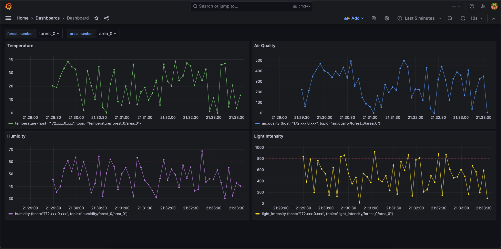
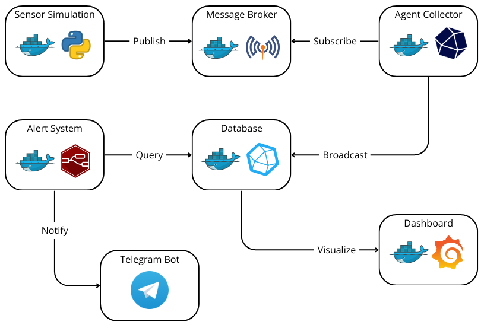

# Forest Fire Detection System

## About the Project


<!-- [![Logo][logo]]() -->
<p align="center">
  
</p>

Forest fires are a cause for great concern to both the ecosystem, wildlife and human settlements. Their destructiveness depends on speedy detection and rapid response. Our IoT-based forest fire detection system stands as a compelling demonstration of an architecture for early fire detection in forested areas. By integrating sensors, data analytics, and real-time alerts via Telegram, the system showcases a path towards quick identification of potential fires. Grafana's data visualization enhances decision-making by offering clear insights into environmental conditions.

Project developed for the Software Engineering for Internet of Things course - University of L'Aquila.


## System Architecture

<p align="center">
  
</p>

## Built with

[![Docker][Docker.com]][Docker-url][![Python][Python.org]][Python-url][![MQTT][MQTT.com]][MQTT-url][![Telegraf][Telegraf.org]][Telegraf-url][![InfluxDB][InfluxDB.com]][InfluxDB-url][![Grafana][Grafana.com]][Grafana-url][![Nodered][Nodered.org]][Nodered-url][![Telegram][Telegram.org]][Telegram-url]

## Getting Started

### Prerequisites

Here are things you need to have on your computer beforehand.

* Docker

### Installation


1. Clone the repo
   ```sh
   git clone https://github.com/AzimovS/iot-forest-fire-detection
   ```
2. Run the containers
   ```sh
   docker-compose up
   ```
3. Navigate to http://localhost:3000/, where you can see the dashboard. Use the following credentials: username=admin, password=admin.

## Configuration

The configuration of the system is mainly contained in the docker-compose.yml file. Be sure that all the exposed mapped ports are free on your environment:

* 1883 and 9001 for Mosquitto MQTT Broker
* 8086 for InfluxDB
* 1886 for Node-RED

To interact with InfluxDB, navigate to http://localhost:8086/. Use the following credentials: username=admin, password=admin123.

## Developed by
* [Alex Montoya Franco](https://github.com/montoruwalkr)
* [Sergo Kashuashvili](https://github.com/frotekz)
* [Sherkhan Azimov](https://github.com/azimovs)

<!-- MARKDOWN LINKS & IMAGES -->
[React.js]: https://img.shields.io/badge/React-20232A?style=for-the-badge&logo=react&logoColor=61DAFB
[React-url]: https://reactjs.org/
[Python.org]: https://img.shields.io/badge/python-3670A0?style=for-the-badge&logo=python&logoColor=ffdd54
[Python-url]: https://www.python.org/
[MUI.com]: https://img.shields.io/badge/MUI-%230081CB.svg?style=for-the-badge&logo=mui&logoColor=white
[MUI-url]: https://mui.com/
[MQTT.com]: https://camo.githubusercontent.com/7032ff43ba978eff463cbbd12e4f747102e73b3cd71bc626171e1e0487099432/68747470733a2f2f696d672e736869656c64732e696f2f7374617469632f76313f7374796c653d666f722d7468652d6261646765266d6573736167653d4d51545426636f6c6f723d363630303636266c6f676f3d4d515454266c6f676f436f6c6f723d464646464646266c6162656c3d
[MQTT-url]: https://mqtt.org/
[Docker.com]: https://img.shields.io/badge/docker-%230db7ed.svg?style=for-the-badge&logo=docker&logoColor=white
[Docker-url]: https://www.docker.com/
[FastAPI.com]: https://img.shields.io/badge/FastAPI-005571?style=for-the-badge&logo=fastapi
[FastAPI-url]: https://fastapi.tiangolo.com/
[InfluxDB.com]: https://img.shields.io/badge/InfluxDB-22ADF6?style=for-the-badge&logo=InfluxDB&logoColor=white
[InfluxDB-url]: https://www.influxdata.com/
[Nodered.org]: https://camo.githubusercontent.com/dba888e83b867790301211b790aa54bbcd0829d8b87d9601adc04bc1d408c4f6/68747470733a2f2f696d672e736869656c64732e696f2f7374617469632f76313f7374796c653d666f722d7468652d6261646765266d6573736167653d4e6f64652d52454426636f6c6f723d384630303030266c6f676f3d4e6f64652d524544266c6f676f436f6c6f723d464646464646266c6162656c3d
[Nodered-url]: https://nodered.org/
[Grafana.com]: https://camo.githubusercontent.com/bc49cd42967fc5be8c364ddf4fa16008584815a3bec1d461dfc5c7214b345238/68747470733a2f2f696d672e736869656c64732e696f2f7374617469632f76313f7374796c653d666f722d7468652d6261646765266d6573736167653d47726166616e6126636f6c6f723d463436383030266c6f676f3d47726166616e61266c6f676f436f6c6f723d464646464646266c6162656c3d
[Grafana-url]: https://grafana.com/
[Telegram.org]: https://camo.githubusercontent.com/64952244a7851ce3715dd9c8f3cb88673be00c8583f283192fd8c2cec645be7a/68747470733a2f2f696d672e736869656c64732e696f2f7374617469632f76313f7374796c653d666f722d7468652d6261646765266d6573736167653d54656c656772616d26636f6c6f723d323641354534266c6f676f3d54656c656772616d266c6f676f436f6c6f723d464646464646266c6162656c3d
[Telegram-url]: https://telegram.org/
[Telegraf.org]: https://camo.githubusercontent.com/38de238268b31df333bd3bdca46953582a42b528390cef904aea00660d0b918d/68747470733a2f2f696d672e736869656c64732e696f2f7374617469632f76313f7374796c653d666f722d7468652d6261646765266d6573736167653d54656c65677261706826636f6c6f723d323232323232266c6f676f3d54656c656772617068266c6f676f436f6c6f723d464146414641266c6162656c3d
[Telegraf-url]: https://www.influxdata.com/time-series-platform/telegraf/